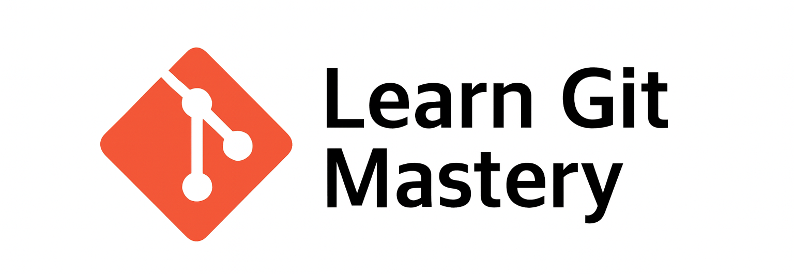

<p align="center">
  
</p>

<p align="center">
  
  
  
  
</p>

---

# ✨ Why This Repo?  

> **“Git mastery is not about memorizing commands – it’s about developing muscle memory through practice.”** 💡  

<div align="center">

| 📘 Tutorials | 🛠️ Hands-on | 🌍 Real-world | 🎯 Quizzes | 🤝 Collaboration |
|--------------|------------|---------------|------------|-----------------|
| Learn step by step | Practice as you go | Not just theory | Validate learning | Work like pros |

</div>

---

## 📑 Table of Contents  

<table width="100%">
  <thead>
    <tr>
      <th style="text-align:left;">#</th>
      <th style="text-align:left;">Topic</th>
      <th style="text-align:left;">Description</th>
    </tr>
  </thead>
  <tbody>
    <tr>
      <td>00</td>
      <td>Getting Started 🏁</td>
      <td>Install + Configure Git</td>
    </tr>
    <tr>
      <td>01</td>
      <td>Creating Snapshots 📸</td>
      <td>Add, Commit, Track changes</td>
    </tr>
    <tr>
      <td>03</td>
      <td>Browsing History 🔍</td>
      <td>Explore past commits</td>
    </tr>
    <tr>
      <td>04</td>
      <td>Branching 🌿</td>
      <td>Branching & Merging</td>
    </tr>
    <tr>
      <td>05</td>
      <td>Collaboration 🤝</td>
      <td>GitHub workflows</td>
    </tr>
    <tr>
      <td>06</td>
      <td>Rewriting History 🕰️</td>
      <td>Rebase, Amend, Squash</td>
    </tr>
    <tr>
      <td>07</td>
      <td>Setup ⚙️</td>
      <td>Oh My Posh custom prompt</td>
    </tr>
    <tr>
      <td>08</td>
      <td>Final Quiz 📝</td>
      <td>Test your skills</td>
    </tr>
  </tbody>
</table>


---

## 🚀 Quick Start  

```bash
# Clone this repo
git clone https://github.com/HashimThePassionate/learn-git-mastery.git

# Move into the folder
cd learn-git-mastery

# Start your journey
code .
````

---

## 📖 What You’ll Learn

✅ Version Control Basics <br/>
✅ Git Snapshots & History <br/>
✅ Branching & Conflict Resolution <br/>
✅ Collaboration with GitHub <br/>
✅ Rewriting History (Pro Level) <br/>
✅ Custom Git Environment <br/>
✅ Final Mastery Quiz

---

## 🤝 Contributing

We ❤️ contributions! Follow these steps:

1. Fork this repo 🍴
2. Create a feature branch 🌱
3. Commit your changes 📝
4. Open a Pull Request 🚀

<p align="center">
  
</p>

---

## 📄 License

📜 Licensed under the **MIT License** – see [LICENSE](LICENSE).

---

## 🌟 Support

**If you like this project:**

<p align="center">
  <a href="https://github.com/HashimThePassionate/learn-git-mastery/stargazers">
    
  </a>
  <a href="https://github.com/HashimThePassionate/learn-git-mastery/fork">
    
  </a>
</p>

---

<p align="center">
  <b>“From Git Beginner ➝ to Git Mastery”</b>
</p>